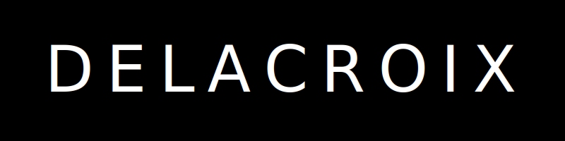

<p align="center">
  
</p>

Delacroix pulls free, openly licensed artwork from museum platforms, downloads high-quality images, and crops them to a Samsung Frame TV friendly aspect ratio (default 16:9). Vertical artworks are skipped.

## Features
- Multiple museum platforms (Art Institute of Chicago, NGA, Louvre, Met Museum, Rijksmuseum)
- Intelligent query building using comprehensive art knowledge database
- Famous artist prioritization
- Landscape-only filtering
- Center crop to configurable aspect ratio
- Tag-based filtering (artists, time periods, cultures, art movements)
- Type-based filtering (paintings, photographs, drawings, sculptures, etc.)
- Guaranteed exact count - keeps fetching until desired number of images is downloaded

## Quick start

```bash
python -m venv .venv
source .venv/bin/activate
pip install -e .

# List available platforms
delacroix list

# Harvest with defaults (5 European paintings from 1800s)
delacroix harvest --platform chicago --out output/chicago

# Harvest from different platforms
delacroix harvest --platform chicago --out output/chicago --max 10
delacroix harvest --platform nga --out output/nga --max 10

# Filter by tags and types
delacroix harvest --platform chicago --out output/monet --max 10 --tags "monet,impressionism"
delacroix harvest --platform chicago --out output/1700s --max 10 --tags "european,1700s"
```

## Platforms

### Art Institute of Chicago (Recommended)
- **Status**: ✓ Working, Fast
- **Strengths**: Excellent API, famous artworks, high-quality images
- **Best for**: Impressionist and modern art

### National Gallery of Art (NGA)
- **Status**: ✓ Working
- **Strengths**: American and European art

### Louvre
- **Status**: ⚠️ Slow
- **Strengths**: French and European masterpieces

### Met Museum
- **Status**: ⚠️ Rate limited
- **Note**: May experience API rate limiting

### Rijksmuseum
- **Status**: ⚠️ Requires API key
- **Note**: Demo API key expired

## Art Knowledge Database

Delacroix includes a comprehensive art knowledge database with:
- 100+ famous artists with lifespans, nationalities, and movements
- Art movements by time period
- Famous paintings and their artists
- Intelligent query building based on your search criteria

This enables smart, targeted searches that prioritize famous artists and relevant artworks.

## License
MIT
